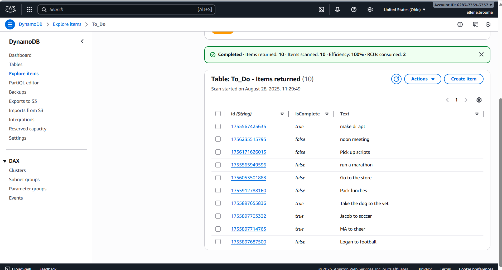
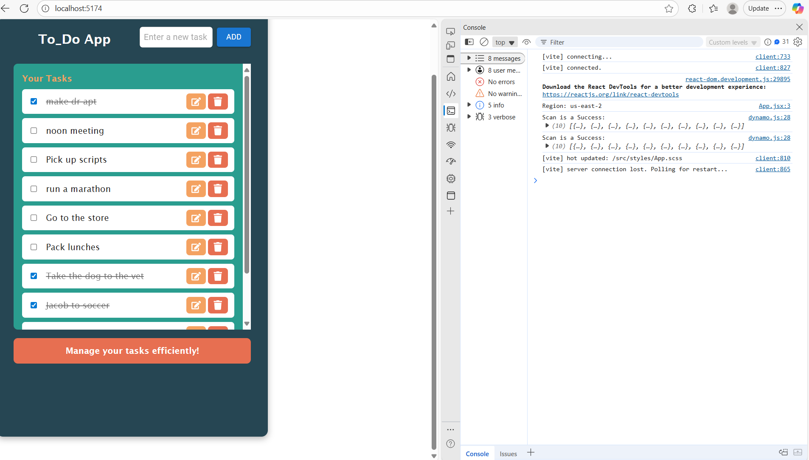
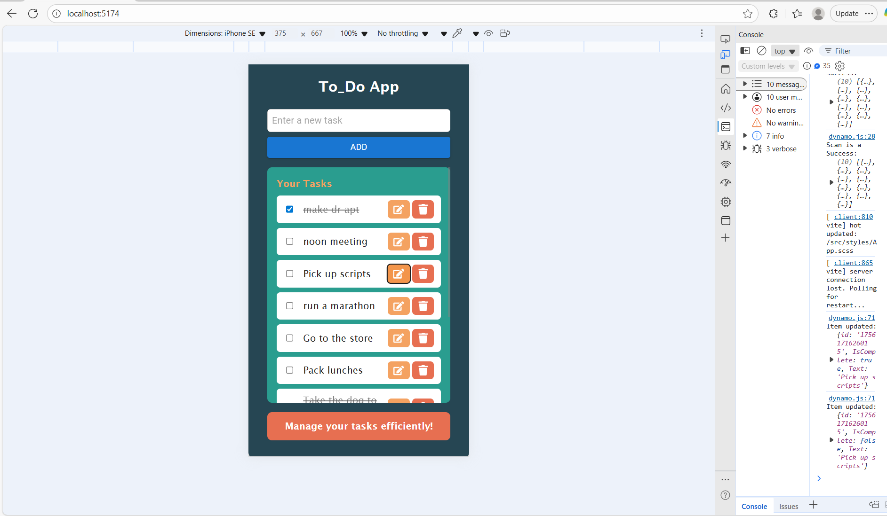

# DynamoDB Todo App

A React + Vite app that reads/writes items in a DynamoDB table. Uses **AWS SDK v3** for data, **Material-UI (MUI)** for UI components, and **Sass (SCSS)** for layout/responsive styling.

## Objectives
- Fetch all TODO items from DynamoDB on component mount.
- Add new TODO items by writing to DynamoDB.
- Use AWS SDK for JavaScript v3 (`@aws-sdk/client-dynamodb`, `@aws-sdk/lib-dynamodb`).
- **Day 3:** Integrate a component library (MUI) and customize via props + Sass.
- **Day 4:** Implement responsive design for mobile/tablet/desktop.

## Tech Stack
- React (Vite)
- AWS SDK v3 (DynamoDB)
- Material-UI (MUI)
- Sass (SCSS)

## Setup & Run

1) **Clone**
```bash
git clone https://github.com/ellene-broome/aws-dynamodb-todo.git
cd aws-dynamodb-todo
```

2. Install dependendencies
```bash
npm install
```
3. Environment variables (Vite requires VITE_ prefix)
Create a .env.local at the project root:
```ini
    REACT_APP_AWS_REGION=us-east-2
    REACT_APP_AWS_ACCESS_KEY_ID=YOUR_KEY_ID
    REACT_APP_AWS_SECRET_ACCESS_KEY=YOUR_SECRET_KEY
```
⚠️ Replace YOUR_KEY_ID and YOUR_SECRET_KEY with your IAM user credentials.

⚠️ Restart the dev server after editing .env.local.

4. Run the app
```bash
npm run dev
```

Open in browser:http://localhost:5173 (Vite default).

## ScreenShots
### AWS ScreenShot

### LocalHost ScreenShot

### Mobile ScreenShot


## AWS Prerequisites
- DynamoDB Table
  - Table name: To_Do
  - Partision key: id (string)
  - Region: ```us-east-2```
- IAM Users + Policy
  - Must allow at least:
    y must allow at least:
    - dynamodb:Scan
    - dynamodb:PutItem
    - dynamodb:UpdateItem
    - dynamodb:DeleteItem
- Create an access key and put values in `.env.local`.

## Features
## Data (CRUD)

- Create: Add new items with text input. Item format in DB: { id, Text, IsComplete }.

- Read: Auto-scan on mount and display all items.

- Update: Toggle IsComplete via checkbox/edit button; UI updates instantly.

- Delete: Remove an item by id; UI updates instantly.

## UI (MUI + Sass)

- Sass: Layout and colors via src/styles/App.scss (.app-container, .section-one, .section-two, .section-three).

- MUI components used: TextField, Button, IconButton (plus Typography optionally).


## Responsive Design 

### Breakpoints

- Mobile: max-width: 600px

- Tablet (optional): max-width: 1024px

- Desktop: default styles

### What changes on mobile:

- Input and button in Section One stack more neatly:
  ```scss
  @media (max-width: 600px) {
  .section-one :where(.MuiTextField-root) {
    width: 100%;
    margin-right: 0;
    margin-bottom: 0.5rem;
    }
  }
  ```
- `\Section-two uses a scroll area to keep the list usable on small screens:
  ```scss
  .section-two {
  max-height: 60vh;
  overflow: auto; 
  }
## Varification
- Env vars load (open console and check import.meta.env.VITE_AWS_REGION).

- Scan works: items appear in the list on load.

- Create works: clicking Add writes a new item and shows it immediately.

- Update works: toggle complete updates DB and UI.

- Delete works: removing an item updates DB and UI.

- Responsive: layout adapts at ≤600px (input width, button spacing, scrollable list).

## Submission

- **Repo URL:** [https://github.com/ellene-broome/aws-dynamodb-todo](https://github.com/ellene-broome/aws-dynamodb-todo)  
