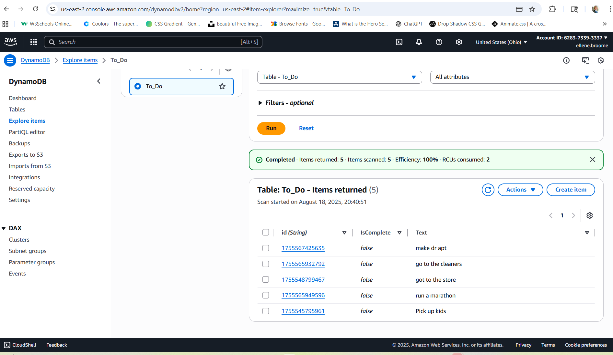
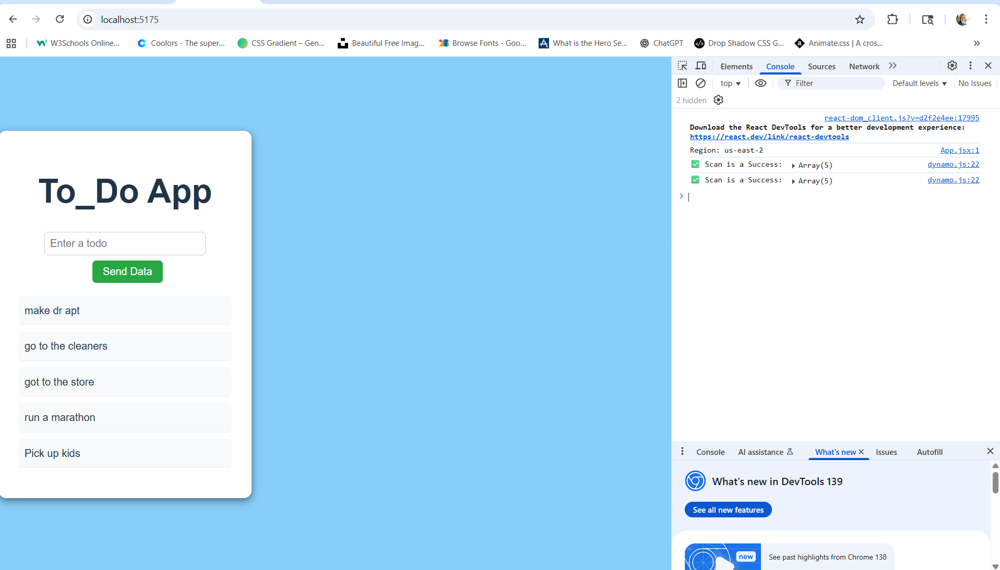

# DynamoDB Todo App 
## Objectives
- Fetch all TODO items from DynamoDB on component mount.
- Allow adding a new TODO by writing an item to DynamoDB.
- Use the AWS SDK for JavaScript v3 (@aws-sdk/client-dynamodb & @aws-sdk/lib-dynamodb).

## Setup & Run
1. Clone the repo
```bash
git clone [aws-dynamobd-todo](https://github.com/ellene-broome/aws-dynamodb-todo.git)
cd aws-dynamobd-todo
```
2. Install dependendencies
```bash
npm install
```
3. Environmental variables
   Creat a .env.local file in the project root:
```ini
    REACT_APP_AWS_REGION=us-east-2
    REACT_APP_AWS_ACCESS_KEY_ID=YOUR_KEY_ID
    REACT_APP_AWS_SECRET_ACCESS_KEY=YOUR_SECRET_KEY
```
⚠️ Replace YOUR_KEY_ID and YOUR_SECRET_KEY with your IAM user credentials.

⚠️ Restart the dev server after editing .env.local.

4. Run the app
```bash
npm run dev
```
Open in browser:http://localhost:5173 (Vite default).

## AWS Prerequisites
- DynamoDB Table
  - Table name: To_Do
  - Partision key: id (string)
  - Region: ```us-east-2```
- IAM Users + Policy
  - Must allow ```dynamodb:Scan``` and ```dynamodb:PutItem``` on the ```To_Do``` table.
  - Create access key under Security Credentials → use in ```.env.local```.

## Verification
1. Confirm env vars load:
   In the browser console, run:
   ```js
   console.log(process.env.REACT_APP_AWS_REGION)
    // should print: us-east-2
    ```

2. Add a new TODO → appears on the page and in DynamoDB table.

3. DynamoDB table screenshot:
   ### DynamoDB Table


App/Console screenshot:


## Day 4 - Undate and Delete
### Features Implemented
- **Create Todos**: Add new items with text input.
- **Read Todos**: Fetch and display all todos from DynamoDB.
- **Update Todos**: Toggle `IsComplete` on/off using a checkbox.
- **Delete Todos**: Remove todos with a delete button (`Delete`).

### UI Features
- Textbox + button to create new todos.  
- List of todos with:
  - Checkbox to toggle completion (`line-through` effect).  
  - Delete button to remove item.  

## Submission

- **Repo URL:** [https://github.com/ellene-broome/aws-dynamodb-todo](https://github.com/ellene-broome/aws-dynamodb-todo)  
